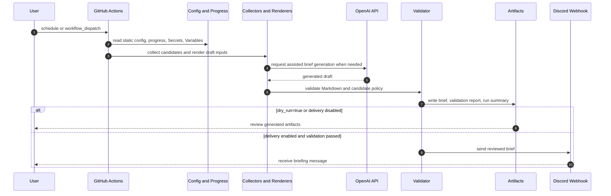

# Career Feed

| 한국어로 시작하기 | Start in English |
| --- | --- |
| [KR Start](./docs/kr/README.md) | [EN Start](./docs/en/README.md) |

## 30-Second Overview

Career Feed is an open workflow project for Java/Kotlin backend learners and junior developers.

It uses GitHub Actions to generate daily or weekly Markdown briefs for backend study, Korean dev/AI news, OSS contribution preparation, and career site checks.

Generated output is reviewed through artifacts and validation reports first, and only sent to Discord Webhook delivery when the user enables delivery.

It is fork-based automation without a persistent server, database, hosted dashboard, Discord Gateway Bot, or Slash Command service.

## What You Get

| Output | What it includes | Korean example | English example |
| --- | --- | --- | --- |
| Daily Backend Brief | Spring Boot/JVM study, Programmers PS routine, OSS preparation, practical backend knowledge | [sample](./docs/kr/examples/daily-backend-brief.example.md) | [sample](./docs/en/examples/daily-backend-brief.example.md) |
| Korea Dev/AI News Daily | Korean development and AI news review with quality checks | [sample](./docs/kr/examples/korea-dev-ai-news-daily.example.md) | [sample](./docs/en/examples/korea-dev-ai-news-daily.example.md) |
| Backend Career Site Radar | Public career, internship, activity, hackathon, and contest source checks | [sample](./docs/kr/examples/career-site-radar.example.md) | [sample](./docs/en/examples/career-site-radar.example.md) |

## Project Status

- Status: Early Public OSS
- Stable release: No stable release yet
- GitHub Releases: none published as of the 2026-06-09 documentation audit
- Release tags: none found in local or `origin` tag list during the same audit
- `v0.1.0` documents are release drafts and do not override actual GitHub release state.

Workflow files are the source of truth for actual cron, inputs, and dispatch behavior.

## How It Works

| Workflow | File | Main output |
| --- | --- | --- |
| Daily Backend Brief | `.github/workflows/kr-tech-daily.yml` | `reports/briefs/kr-tech-daily.md` |
| Korea Dev/AI News Daily | `.github/workflows/kr-tech-news-daily.yml` | `reports/briefs/kr-tech-news-daily.md` |
| Backend Career Site Radar | `.github/workflows/kr-backend-career-weekly.yml` | `reports/briefs/kr-backend-career-weekly.md` |
| Mark PS Solved | `.github/workflows/mark-ps-solved.yml` | `data/ps-progress.json` update |

## Safety / Limitations

- API keys and Discord webhook URLs must stay in GitHub Actions Secrets or local environment variables.
- Discord delivery is disabled by default, and `dry_run=true` never sends to Discord.
- Generated briefs must pass validation before Discord delivery.
- OSS candidates are recommended only when they satisfy the configured `created_at` recency policy.
- If no safe candidate exists, Career Feed renders a fallback preparation routine instead of forcing old issues.
- Career Feed does not auto-comment, open pull requests, assign issues, or change labels on external GitHub repositories.
- Briefs are starting points for review, not final career advice.

## Documentation

| Language | Start | First setup |
| --- | --- | --- |
| 한국어 | [docs/kr/README.md](./docs/kr/README.md) | [Fork Setup Guide](./docs/kr/getting-started/fork-setup.md) |
| English | [docs/en/README.md](./docs/en/README.md) | [Fork Setup Guide](./docs/en/getting-started/fork-setup.md) |

The documentation gateway is [docs/README.md](./docs/README.md).

## Repository Structure

| Path | Purpose |
| --- | --- |
| `.github/workflows/` | GitHub Actions workflows |
| `configs/` | Static briefing and collection policy config |
| `data/` | PS progress and small state files |
| `docs/kr/` | Korean documentation |
| `docs/en/` | English documentation |
| `docs/assets/` | Shared documentation assets |
| `scripts/` | Collection, rendering, validation, and delivery scripts |
| `tests/` | Policy and script validation tests |

Generated reports are written under `reports/` during workflow runs and are not meant to be committed by default.

## Contributing

Choose a language first:

| 한국어 | English |
| --- | --- |
| [기여 안내](./docs/kr/CONTRIBUTING.md) | [Contributing](./docs/en/CONTRIBUTING.md) |

Community expectations:

| 한국어 | English |
| --- | --- |
| [행동 규범](./docs/kr/CODE_OF_CONDUCT.md) | [Code of Conduct](./docs/en/CODE_OF_CONDUCT.md) |

## License

MIT License. See [LICENSE](./LICENSE).
