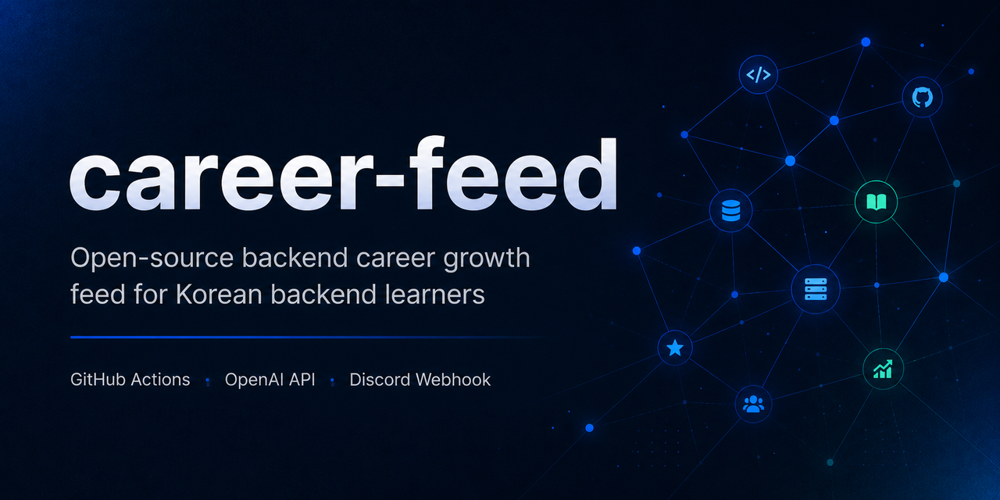
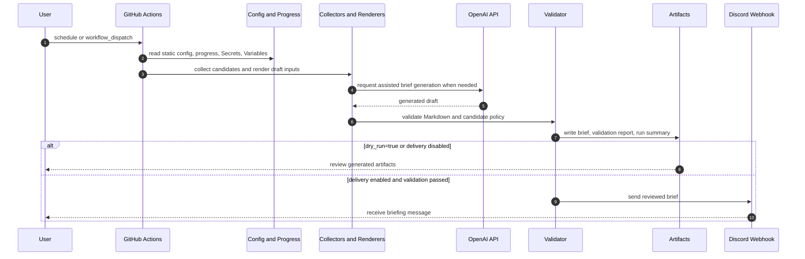

# Career Feed



| 한국어로 시작하기 | Start in English |
| --- | --- |
| [KR Start](./docs/kr/README.md) | [EN Start](./docs/en/README.md) |

## 30-Second Overview

Career Feed is a configurable locale-aware briefing automation workflow for backend learners and developer communities.

It uses GitHub Actions to generate daily or weekly Markdown briefs for backend study, locale-specific dev/AI news, OSS contribution preparation, and career site checks.

Generated output is reviewed through artifacts and validation reports first, and only sent to Discord Webhook delivery when the user enables delivery.

It is fork-based automation without a persistent server, database, hosted dashboard, Discord Gateway Bot, or Slash Command service.

## Supported Locales

| Locale | Status | Audience | Search provider preset |
| --- | --- | --- | --- |
| `ko-KR` | Default supported locale | Korean Java/Kotlin backend learners | `naver,rss,github` |
| `en-US` | v0.2 foundation / experimental preset | English-speaking backend learners and junior developers | `brave,rss,github` |

Set `CAREER_FEED_ENABLED_LOCALES=ko-KR,en-US` to generate separate dry-run artifacts for both locales.
Webhook URLs remain GitHub Secrets, while enabled locales and provider names are GitHub Variables.
Additional locales are later community-maintained work.

`ko-KR` is the supported default path today. It includes the Korean source assumptions, Discord webhook fallback names, legacy mirror artifact paths, and validation fixtures that existing fork users rely on.

`en-US` is available as a v0.2 foundation for testing locale-aware prompts, artifacts, fixtures, and webhook naming. Its source/provider coverage is still experimental and should not be described as mature global support.

## OSS Readiness / Impact

| Signal | Current evidence |
| --- | --- |
| Who uses this | Early project for fork-based use by Java/Kotlin backend learners, Discord study groups, and mentoring groups that want reviewable daily briefs. |
| Why this matters | It turns scattered backend learning, locale-specific dev/AI news, OSS contribution prep, and career source checks into repeatable GitHub Actions artifacts. |
| First fork setup | First Backend Daily dry-run needs only the `OPENAI_API_KEY` repository Secret; repository Variables are optional overrides. |
| Maintainer workload | Contributor entry points are intentionally small: documentation fixes, source suggestions, validation fixtures, and OSS candidate review. |
| Codex/API usage | OpenAI-assisted output is constrained to reviewable Markdown drafts, validation summaries, topic prioritization, and OSS candidate notes. |
| Usage signal | No adoption metric is claimed yet; the repository is presented as fork-ready, not as a project with existing stars, downloads, or active-user numbers. |

| Demo evidence | What it shows |
| --- | --- |
| [Dry-run dispatch](./docs/assets/demo/github-actions-dispatch-redacted.png) | Manual GitHub Actions run with safe inputs. |
| [Artifact summary](./docs/assets/demo/actions-summary-redacted.png) | Generated artifacts and workflow summary. |
| [Validation report](./docs/assets/demo/validation-report-redacted.png) | Reviewable validation output before Discord delivery. |
| [Discord redacted output](./docs/assets/demo/discord-brief-redacted.png) | Example Discord briefing with private details removed. |
| [Demo guide](./docs/kr/demo.md) / [Demo guide EN](./docs/en/demo.md) | Redaction rules and demo boundaries. |

## What You Get

| Output | What it includes | Korean example | English example |
| --- | --- | --- | --- |
| Daily Backend Brief | Spring Boot/JVM study, Programmers PS routine, OSS preparation, practical backend knowledge | [sample](./docs/kr/examples/daily-backend-brief.example.md) | [sample](./docs/en/examples/daily-backend-brief.example.md) |
| Dev News Daily | Locale-specific developer and AI news review with quality checks | [sample](./docs/kr/examples/korea-dev-ai-news-daily.example.md) | [sample](./docs/en/examples/korea-dev-ai-news-daily.example.md) |
| Backend Career Site Radar | Public career, internship, activity, hackathon, and contest source checks | [sample](./docs/kr/examples/career-site-radar.example.md) | [sample](./docs/en/examples/career-site-radar.example.md) |

## Project Status

- Status: Early Public OSS
- Latest release: [`v0.2.1`](https://github.com/stdiodh/career-feed/releases/tag/v0.2.1)
- Release date: 2026-06-11
- Release baseline: fork-based GitHub Actions workflows with one-secret first dry-run, dry-run artifact review, schedule-disabled-by-default safety, and optional Discord Webhook delivery.

Workflow files are the source of truth for actual cron, inputs, and dispatch behavior.

Release and compatibility details:

- [v0.2.1 changelog](./CHANGELOG.md)
- [v0.2.0 locale foundation baseline](./docs/project/release-v0.2.0.md)
- [v0.2 compatibility notes](./docs/project/v0.2-compatibility.md)
- [release checklist](./docs/project/release-checklist.md)

## Provider Status

| Provider | Locale role | Current status |
| --- | --- | --- |
| Naver News Search | `ko-KR` news enrichment | Optional credential-backed collection path for Korean news candidates |
| RSS / Atom | `ko-KR`, `en-US` | Active source input through locale config and collector logic |
| GitHub | Daily Backend OSS candidates | Active OSS candidate discovery and safety validation path |
| Brave Search | `en-US` preset | v0.2 scaffold/foundation; optional credential warning exists, deeper integration remains roadmap work |

Provider marker modules live under `scripts/search_providers/`, but the v0.2 collector still keeps much of the implementation in `scripts/collect-kr-feeds.py` for compatibility.

## How It Works



| Workflow | File | Main output |
| --- | --- | --- |
| Daily Backend Brief | `.github/workflows/backend-daily.yml` | `reports/briefs/{locale}/backend-daily.md` |
| Dev News Daily | `.github/workflows/dev-news-daily.yml` | `reports/briefs/{locale}/news-daily.md` |
| Backend Career Site Radar | `.github/workflows/backend-career-weekly.yml` | `reports/briefs/ko-KR/backend-career-weekly.md` |
| Mark PS Solved | `.github/workflows/mark-ps-solved.yml` | `data/ps-progress.json` update |

For `ko-KR`, v0.2.x also writes legacy mirror files such as `reports/briefs/kr-tech-daily.md` for compatibility.
New forks should use the canonical workflow names, locale-specific artifact paths, and locale-specific Discord webhook Secret names.

## Safety / Limitations

- API keys and Discord webhook URLs must stay in GitHub Actions Secrets or local environment variables.
- Discord delivery is disabled by default, and `dry_run=true` never sends to Discord.
- First Backend Daily dry-run requires only `OPENAI_API_KEY`; Discord, Naver, Brave, and repository Variables are optional later setup.
- Scheduled generation is disabled by default with `CAREER_FEED_SCHEDULE_ENABLED=false`; manual `workflow_dispatch` still works.
- Discord delivery can use `DISCORD_WEBHOOK_CAREER_FEED` as a generic fallback after specific and legacy webhook Secrets.
- Generated briefs must pass validation before Discord delivery.
- OSS candidates are recommended only when they satisfy the configured `created_at` recency policy.
- If no safe candidate exists, Career Feed renders a fallback preparation routine instead of forcing old issues.
- Career Feed does not auto-comment, open pull requests, assign issues, or change labels on external GitHub repositories.
- Briefs are starting points for review, not final career advice.

Not supported yet:

- Mature provider abstraction for every provider module.
- Fully mature `en-US` source quality comparable to the `ko-KR` default path.
- Locale expansion beyond `ko-KR` and the experimental `en-US` foundation.
- Hosted dashboards, persistent services, databases, Discord Gateway Bots, Slash Commands, account systems, or recruiting matching.

## Documentation

| Language | Start | First setup |
| --- | --- | --- |
| 한국어 | [docs/kr/README.md](./docs/kr/README.md) | [Fork Setup Guide](./docs/kr/getting-started/fork-setup.md) |
| English | [docs/en/README.md](./docs/en/README.md) | [Fork Setup Guide](./docs/en/getting-started/fork-setup.md) |

The documentation gateway is [docs/README.md](./docs/README.md).

## Repository Structure

| Path | Purpose |
| --- | --- |
| `.github/workflows/` | GitHub Actions workflows |
| `configs/` | Static briefing and collection policy config |
| `data/` | PS progress and small state files |
| `docs/kr/` | Korean documentation |
| `docs/en/` | English documentation |
| `docs/assets/` | Shared documentation assets |
| `scripts/` | Collection, rendering, validation, and delivery scripts |
| `tests/` | Policy and script validation tests |

Generated reports are written under `reports/` during workflow runs and are not meant to be committed by default.

## Contributing

Choose a language first:

| 한국어 | English |
| --- | --- |
| [기여 안내](./docs/kr/CONTRIBUTING.md) | [Contributing](./docs/en/CONTRIBUTING.md) |

Community expectations:

| 한국어 | English |
| --- | --- |
| [행동 규범](./docs/kr/CODE_OF_CONDUCT.md) | [Code of Conduct](./docs/en/CODE_OF_CONDUCT.md) |

Useful contributor entry points include documentation corrections, source suggestions, validation fixtures, provider expansion notes, issue triage improvements, and small compatibility fixes. Do not add fake usage metrics or claim adoption that is not evidenced in the repository.

Before opening a PR, run the most relevant checks:

```bash
git diff --check
python3 scripts/check-doc-format.py
./scripts/validate.sh
```

## License

MIT License. See [LICENSE](./LICENSE).
