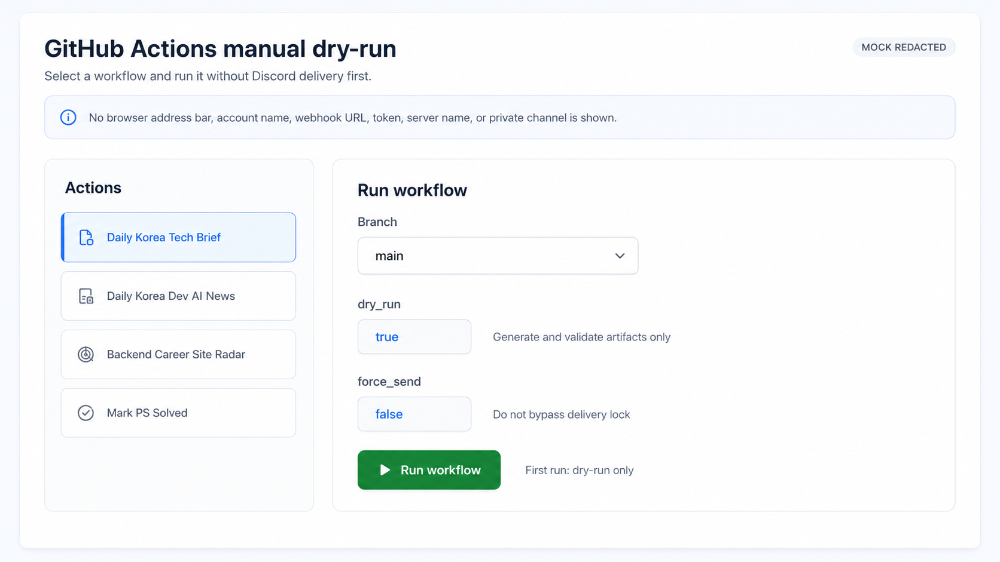
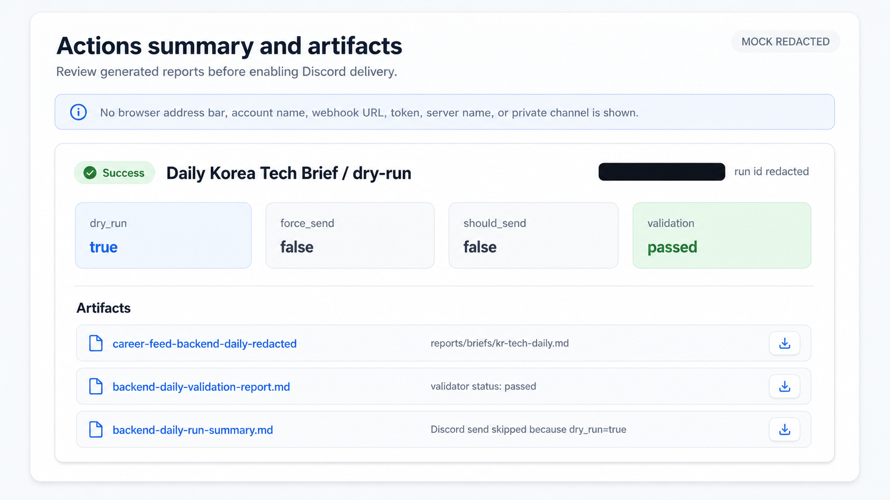
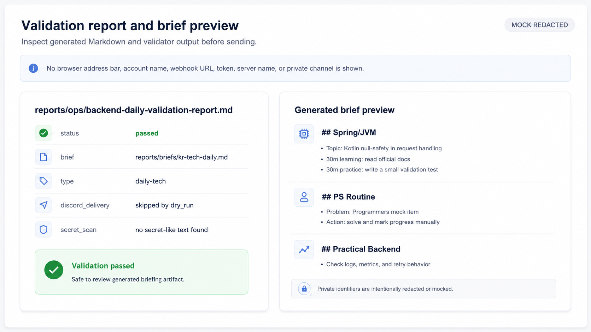
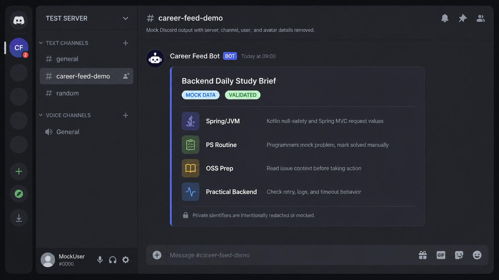

# 데모 가이드

## 목적

이 문서는 Career Feed를 실행하면 무엇이 만들어지고 어떤 화면으로 확인할 수 있는지 보여주기 위한 데모 가이드입니다.

데모의 목적은 새 사용자가 GitHub Actions 실행, validation artifact 확인, 생성된 Markdown briefing, Discord Webhook 전송 결과를 빠르게 이해하도록 돕는 것입니다.

이 문서는 실제 운영 secret이나 private Discord 정보를 공개하지 않는 것을 전제로 합니다.

데모는 제품 홍보 화면이 아니라 운영 흐름을 설명하는 문서입니다.

Career Feed가 웹 대시보드, Discord Gateway Bot, Slash Command, 채용 매칭 서비스처럼 보이지 않게 유지합니다.

## 데모 범위

Career Feed는 브라우저에서 사용하는 웹 앱이 아닙니다.

따라서 데모의 중심은 GitHub Actions 화면, Actions summary, validation report, generated artifact, Discord output입니다.

실제 secret을 사용하는 live run보다는 redacted screenshot 또는 mock data 기반 화면을 권장합니다.

Discord 전송 화면은 실제 운영 서버가 아니라 테스트 서버 또는 redacted screenshot을 사용합니다.

실제 Discord webhook URL, OpenAI API key, Naver credential, private Discord server name, private channel name, user id, avatar, account name, private repository URL은 보여주지 않습니다.

한국 외 지역 확장 가능성을 언급할 수는 있지만, 모든 국가나 언어를 이미 지원한다고 표현하지 않습니다.

외부 저장소에 자동 댓글, 자동 PR, 자동 assign, 자동 label 변경을 하는 것처럼 보이면 안 됩니다.

## 데모에서 보여줄 것

권장 데모는 네 장면으로 구성합니다.

1. GitHub Actions에서 `workflow_dispatch`를 실행하는 장면.
2. Actions summary 또는 validation report를 확인하는 장면.
3. artifacts 또는 `reports/`에서 생성된 briefing을 확인하는 장면.
4. Discord에 도착한 redacted briefing 예시를 확인하는 장면.

이 네 장면이면 Career Feed 실행 흐름을 충분히 설명할 수 있습니다.

입력, 검증, 산출물, 최종 전송을 보여주되 별도 애플리케이션 UI가 있는 것처럼 표현하지 않습니다.

현재 저장소에는 이 흐름을 설명하는 mock redacted screenshot이 포함되어 있습니다.

아래 이미지는 실제 GitHub 또는 Discord live capture가 아니라 설명용 mock screenshot입니다.









## 권장 데모 흐름

짧은 GIF를 만든다면 60~90초 이하를 기준으로 합니다.

다만 처음에는 GIF보다 정적 screenshot 3~4장을 우선합니다.

GIF는 화면 전환 중 주소창, 계정명, 서버명, 사용자명, private URL이 스쳐 지나갈 수 있어 검토 부담이 큽니다.

기본 흐름은 GitHub Actions workflow 화면에서 시작합니다.

`Daily Korea Tech Brief` 또는 `Daily Korea Dev AI News` workflow를 선택합니다.

`Run workflow` 입력 화면에서 dry-run 또는 artifact-only 옵션을 보여줍니다.

완료된 redacted run의 Actions summary를 엽니다.

업로드된 artifact 목록을 확인합니다.

생성된 Markdown brief 또는 validation report를 미리 봅니다.

마지막으로 Discord에 도착한 redacted briefing 형태를 보여줍니다.

caption이나 callout은 짧게 사용합니다.

브라우저 주소창에 token, query parameter, private repository path, 계정별 URL이 보이면 캡처하지 않습니다.

## Fork onboarding demo checklist

fork 사용자가 첫 실행 흐름을 이해하도록 데모에는 dry-run 중심 장면을 우선 포함합니다.

권장 capture 대상은 다음과 같습니다.

- GitHub Actions manual dispatch 화면
- `dry_run=true` 입력이 보이는 dry-run 실행 화면
- successful dry-run summary
- generated Markdown artifact
- validation report artifact
- OSS safe 후보가 없을 때 fallback routine이 나온 결과
- `CAREER_FEED_DISCORD_DELIVERY_ENABLED=true`로 전송을 켠 뒤의 Discord delivery 결과

아직 이미지 파일이 없다면 README에서 이미지 링크를 걸지 말고, 이 목록을 기준으로 asset을 준비합니다.

권장 파일명은 다음과 같습니다.

- `docs/assets/demo/actions-manual-dispatch.png`
- `docs/assets/demo/actions-dry-run-success.png`
- `docs/assets/demo/generated-brief-artifact.png`
- `docs/assets/demo/validation-report-artifact.png`
- `docs/assets/demo/oss-fallback-example.png`
- `docs/assets/demo/discord-daily-brief.png`

## 스크린샷 체크리스트

권장 screenshot 파일은 다음과 같습니다.

- `github-actions-dispatch-redacted.png`
- `actions-summary-redacted.png`
- `validation-report-redacted.png`
- `discord-brief-redacted.png`

각 screenshot은 commit 전에 사람이 직접 확인해야 합니다.

redacted 또는 mock data 기반 화면만 사용합니다.

README나 이 문서에서 screenshot을 링크할 때는 해당 파일이 실제로 `docs/assets/demo/`에 존재해야 합니다.

이미지가 준비되지 않았다면 placeholder image를 만들지 말고 문서에 의도만 설명합니다.

## GIF 체크리스트

권장 GIF 파일명은 다음과 같습니다.

- `career-feed-demo.gif`

GIF는 60~90초 이하를 권장합니다.

가능하면 너비는 1280px 이하로 유지합니다.

secret, webhook URL, private channel, username, avatar, user id, private repository URL이 보이면 안 됩니다.

caption이나 callout은 짧게 유지합니다.

repository에 넣기 전에 파일 크기를 확인합니다.

GIF가 너무 크면 README에는 GIF 대신 정적 screenshot과 외부 video link를 사용합니다.

repository에 GIF를 넣는다면 가능한 한 작게 유지합니다.

좋은 기준은 10MB 이하입니다.

## 영상 녹화 가이드

큰 mp4 파일은 repository에 직접 커밋하지 않는 것을 기본 원칙으로 합니다.

긴 영상이 필요하면 GitHub Release asset, PR attachment, project page, external video link를 사용합니다.

README에서는 무거운 영상보다 GIF 또는 정적 screenshot을 우선합니다.

실제 secret 입력 장면은 녹화하지 않습니다.

GitHub Secrets 화면은 가능한 한 보여주지 않습니다.

secret 이름만 보여도 운영 힌트가 될 수 있으므로 mock 화면이나 문서 설명으로 대체합니다.

브라우저 주소창에 token, query parameter, private repository path, account-specific URL이 보이면 안 됩니다.

Discord direct message나 private server navigation은 포함하지 않습니다.

## Redaction 규칙

Discord webhook URL은 노출하지 않습니다.

OpenAI API key는 노출하지 않습니다.

Naver credential은 노출하지 않습니다.

Discord server identifier, channel identifier, user identifier, username, avatar는 노출하지 않습니다.

개인 DM, private email, account name은 노출하지 않습니다.

private repository URL은 노출하지 않습니다.

브라우저 주소창에 token이나 query parameter가 보이면 안 됩니다.

Actions log에 secret-like 문자열이 보이면 캡처하지 않습니다.

redaction이 필요한 screenshot은 `docs/assets/demo/`에 넣기 전에 먼저 처리합니다.

텍스트가 복구될 수 있는 blur보다 crop 또는 solid block redaction을 우선합니다.

## 예시 데모 스토리보드

| 시간 | 장면 | 보여줄 내용 | 캡션 |
| --- | --- | --- | --- |
| 0-10s | GitHub Actions | Daily Backend Brief workflow 선택 | dry-run mode로 workflow를 수동 실행합니다 |
| 10-25s | Workflow inputs | dry-run 옵션 확인 | Discord 전송 전에는 dry-run으로 시작합니다 |
| 25-45s | Actions summary | validation report 확인 | 생성된 artifact와 validation output을 검토합니다 |
| 45-65s | Report preview | generated brief artifact 확인 | 전송 전에 brief 내용을 확인합니다 |
| 65-90s | Discord | redacted brief message 확인 | 검토된 brief만 Discord로 전송합니다 |

같은 구조는 Korea Dev/AI News Daily에도 사용할 수 있습니다.

Backend Career Site Radar는 dry-run 장면 대신 `send_to_discord=false`를 보여줍니다.

Mark PS Solved는 branch와 account detail이 안전하게 가려진 경우에만 입력 form과 `data/ps-progress.json` 변경을 보여줍니다.

## 예시 캡션

운영 모델을 설명하는 짧은 caption을 사용합니다.

- workflow를 수동으로 실행합니다.
- 첫 실행은 dry-run으로 시작합니다.
- validation artifacts를 검토합니다.
- 생성된 brief를 확인합니다.
- 검토 후에만 전송합니다.
- Discord에는 검토된 briefing만 도착합니다.
- PS progress는 수동 workflow로 갱신합니다.

hosted dashboard, autonomous bot, hiring recommendation engine처럼 보이는 caption은 사용하지 않습니다.

## 보여주면 안 되는 것

실제 secret 값은 보여주지 않습니다.

webhook URL은 보여주지 않습니다.

private Discord server name, channel name, username, avatar, user id는 보여주지 않습니다.

private repository URL이나 private organization name은 보여주지 않습니다.

Discord direct message는 보여주지 않습니다.

stars, forks, active users, downloads, customer count 같은 fake metric은 쓰지 않습니다.

외부 저장소에 자동 comment나 PR을 만드는 장면은 보여주지 않습니다.

Slash Command 흐름은 보여주지 않습니다.

프로젝트에 실제로 웹 대시보드가 추가되기 전까지 dashboard 화면을 만들지 않습니다.

blur 아래 민감 텍스트가 복구될 수 있는 screenshot은 포함하지 않습니다.

## 에셋 이름 규칙

demo asset은 `docs/assets/demo/` 디렉터리에 둡니다.

권장 경로는 다음과 같습니다.

- `docs/assets/demo/github-actions-dispatch-redacted.png`
- `docs/assets/demo/actions-summary-redacted.png`
- `docs/assets/demo/validation-report-redacted.png`
- `docs/assets/demo/discord-brief-redacted.png`
- `docs/assets/demo/career-feed-demo.gif`

실제로 존재하는 파일만 링크합니다.

asset을 교체할 때도 실제로 존재하는 파일만 문서에서 링크합니다.

placeholder image는 만들지 않습니다.

## 데모 에셋 최신화

workflow 이름, input, artifact 이름, Discord message format이 바뀌면 demo asset도 검토합니다.

오래된 UI label이 보이는 screenshot은 제거하거나 교체합니다.

각 screenshot은 해당 단계를 설명하는 최소한의 안전한 영역에 집중합니다.

asset을 추가하거나 교체한 뒤에는 파일 존재 여부를 확인합니다.

```bash
find docs/assets/demo -maxdepth 1 -type f -print
```

이미지나 GIF를 추가했다면 파일 크기를 확인합니다.

```bash
du -h docs/assets/demo/*
```

PR merge 전에는 민감 정보가 없음을 사람이 직접 확인했다는 내용을 남깁니다.

## 관련 문서

- [README.md](../README.md)
- [사용 가이드](./getting-started/usage.md)
- [Daily Backend Brief 운영 문서](./operations/daily-backend-brief.md)
- [Korea Dev/AI News Daily 운영 문서](./operations/daily-news-ops.md)
- [Backend Career Site Radar 운영 문서](./operations/career-site-radar.md)
- [로컬 검증 가이드](./operations/local-validation.md)
- [보안 정책](../SECURITY.md)
