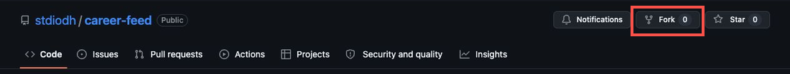
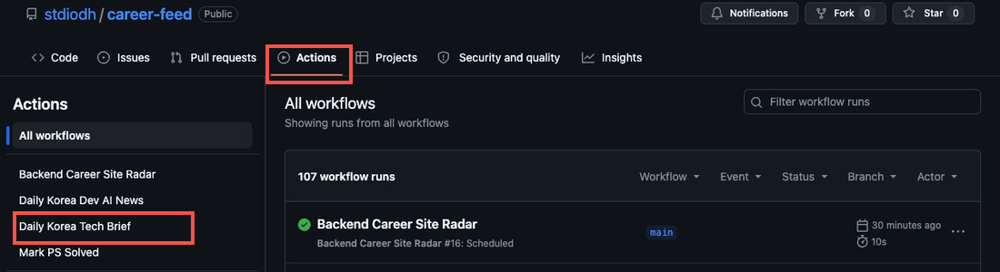
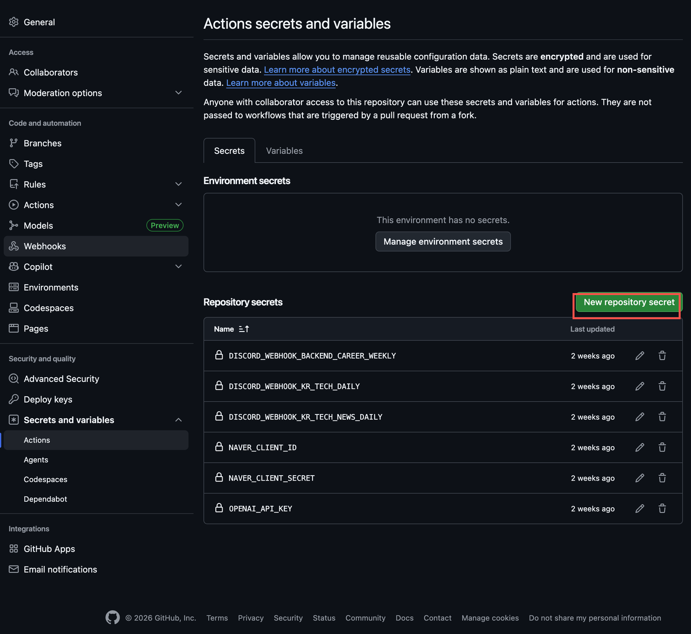
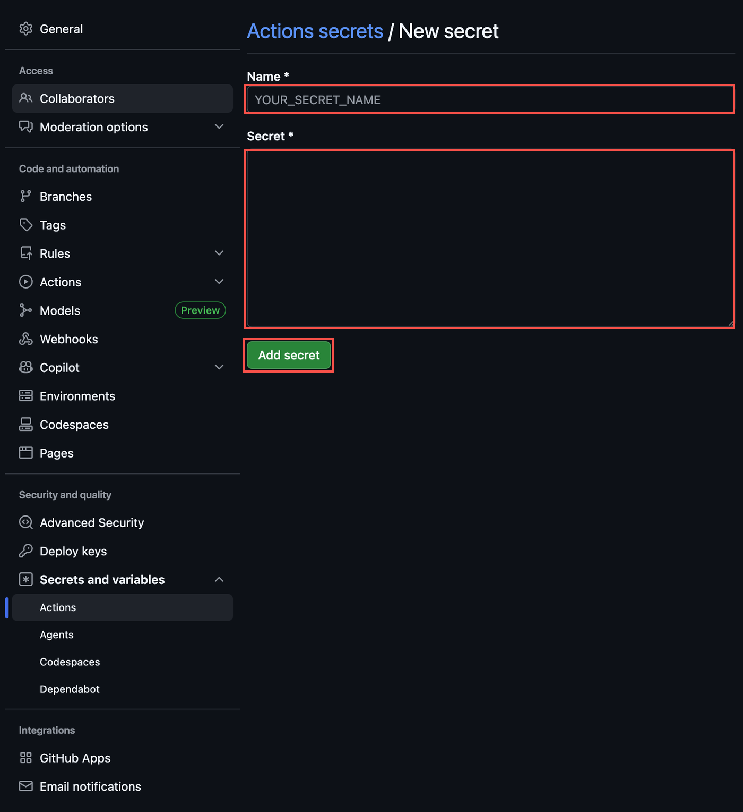
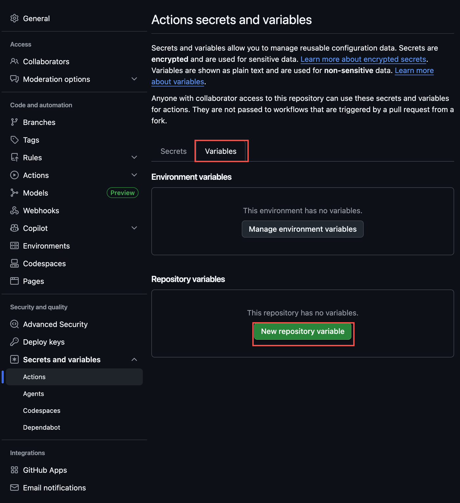
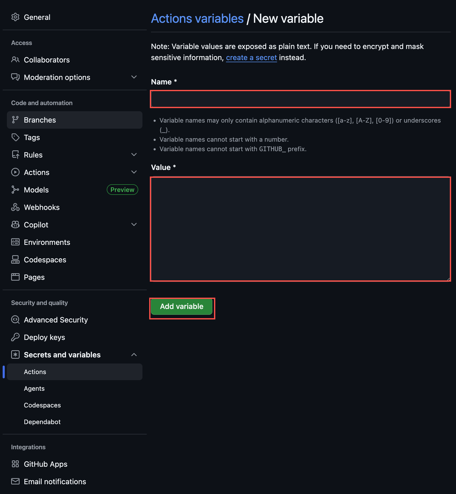
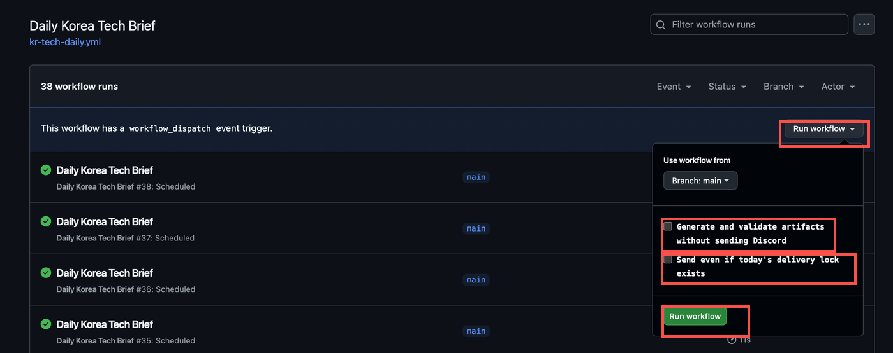
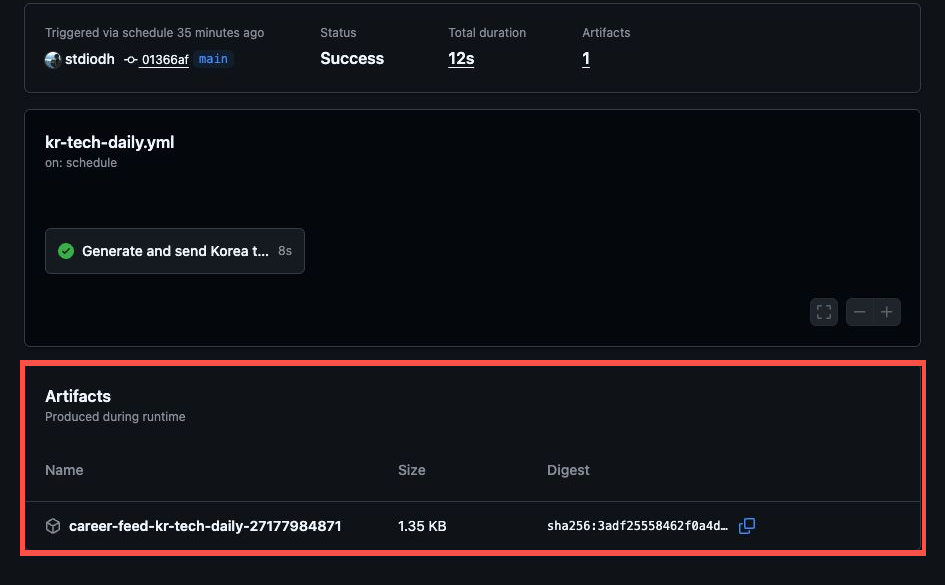
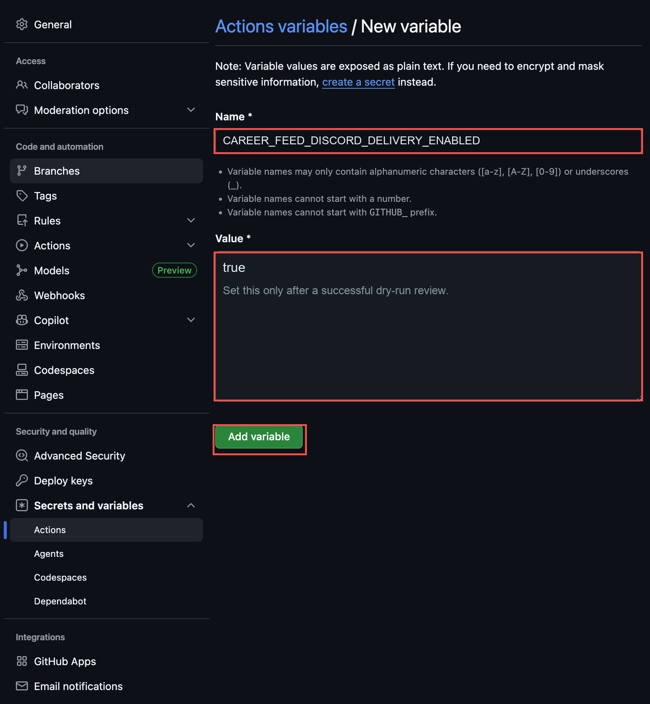

# Fork Setup Guide

> Language: [한국어](../../kr/getting-started/fork-setup.md) | [English](./fork-setup.md)

This guide gets a forked Career Feed repository to the first successful dry-run, artifact review, and optional Discord delivery.

For setting details, see [Runtime Configuration](runtime-configuration.md). For routine operation, see [Usage Guide](usage.md). For OSS rules, see [OSS Candidate Policy](../policies/oss-candidate-policy.md).

## Before You Start

Prepare these items:

- GitHub account
- Forked Career Feed repository
- OpenAI API key
- Discord Webhook URL
- Optional Naver or Brave Search API credentials

Security rules:

- Do not put real API keys, webhook URLs, tokens, or client secrets in docs, issues, pull requests, commits, logs, or screenshots.
- Put API keys, Discord Webhook URLs, and client secrets in GitHub Actions Secrets.
- Put non-sensitive settings such as timezone, target time, and delivery flags in GitHub Actions Variables.
- Start the first run with `dry_run=true` and `force_send=false`.

The screenshots use real GitHub UI screens. If button names move slightly, follow the navigation path and input values.

## Step 1. Fork Repository

Fork `stdiodh/career-feed` on GitHub.

1. Click `Fork` in the original repository header.
2. Create the fork under your account or organization.
3. Continue from the default branch of your fork.

Do not edit workflow YAML first. Configure Secrets and Variables first.

## Step 2. Enable GitHub Actions

Open the `Actions` tab in the fork.

1. Click the repository `Actions` tab.
2. If GitHub blocks fork workflow execution, click `I understand my workflows, go ahead and enable them` or the equivalent enable button.
3. Confirm that `Backend Daily Brief`, `Dev News Daily`, `Backend Career Site Radar`, and `Mark PS Solved` appear in the workflow list.

Scheduled runs work reliably from the default branch.

## Step 3. Add GitHub Actions Secrets

Go to `Settings > Secrets and variables > Actions > Secrets`.

1. Select the `Secrets` tab.
2. Click `New repository secret`.
3. Enter the exact secret name from the table in `Name`.
4. Enter the real value in `Secret`.
5. Click `Add secret`.

| Name | Required | Used by |
| --- | --- | --- |
| `OPENAI_API_KEY` | Required | Brief generation |
| `DISCORD_WEBHOOK_KO_KR_BACKEND_DAILY` | Required for `ko-KR` Daily Backend delivery | Daily Backend Brief |
| `DISCORD_WEBHOOK_EN_US_BACKEND_DAILY` | Required for `en-US` Daily Backend delivery | Daily Backend Brief |
| `DISCORD_WEBHOOK_KO_KR_NEWS_DAILY` | Required for `ko-KR` News Daily delivery | Dev News Daily |
| `DISCORD_WEBHOOK_EN_US_NEWS_DAILY` | Required for `en-US` News Daily delivery | Dev News Daily |
| `DISCORD_WEBHOOK_KR_TECH_DAILY` | Compatibility fallback | `ko-KR` Daily Backend Brief |
| `DISCORD_WEBHOOK_KR_TECH_NEWS_DAILY` | Compatibility fallback | `ko-KR` Dev News Daily |
| `DISCORD_WEBHOOK_BACKEND_CAREER_WEEKLY` | Required for Career Radar delivery | Backend Career Site Radar |
| `NAVER_CLIENT_ID` | Optional | `ko-KR` source integration |
| `NAVER_CLIENT_SECRET` | Optional | `ko-KR` source integration |
| `BRAVE_SEARCH_API_KEY` | Optional | `en-US` source integration |
| `DISCORD_WEBHOOK_CAREER_FEED_OPS` | Optional | Ops/debug alerts |

Use obvious placeholders such as `your-openai-api-key` only in docs or examples.

## Step 4. Add GitHub Actions Variables

Go to `Settings > Secrets and variables > Actions > Variables`.

1. Select the `Variables` tab.
2. Click `New repository variable`.
3. Enter the variable name in `Name`.
4. Enter the setting value in `Value`.
5. Click `Add variable`.

| Name | Required | Default | First value |
| --- | --- | --- | --- |
| `CAREER_FEED_ENABLED_LOCALES` | Optional | `ko-KR` | `ko-KR` |
| `CAREER_FEED_DEFAULT_LOCALE` | Optional | `ko-KR` | `ko-KR` |
| `CAREER_FEED_SEARCH_PROVIDERS_KO_KR` | Optional | `naver,rss,github` | `naver,rss,github` |
| `CAREER_FEED_SEARCH_PROVIDERS_EN_US` | Optional | `brave,rss,github` | `brave,rss,github` |
| `CAREER_FEED_TIMEZONE` | Optional | `Asia/Seoul` | `Asia/Seoul` |
| `CAREER_FEED_BACKEND_DAILY_TIME` | Optional | `09:00` | `09:00` |
| `CAREER_FEED_NEWS_DAILY_TIME` | Optional | `09:05` | `09:05` |
| `CAREER_FEED_CAREER_WEEKLY_DAY` | Optional | `MON` | `MON` |
| `CAREER_FEED_CAREER_WEEKLY_TIME` | Optional | `09:00` | `09:00` |
| `CAREER_FEED_OSS_RECENT_DAYS` | Optional | `30` | `30` |
| `CAREER_FEED_DISCORD_DELIVERY_ENABLED` | Optional | `false` | `false` |

Keep `CAREER_FEED_DISCORD_DELIVERY_ENABLED=false` before the first dry-run.

Use `HH:MM` for time, `MON` through `SUN` for weekdays, and IANA timezone names such as `Asia/Seoul`.

## Step 5. Run Workflow with Dry Run

Open `Actions` and choose `Backend Daily Brief`.

1. Click `Run workflow`.
2. Confirm the branch is the default branch.
3. Set `dry_run` to `true`.
4. Set `force_send` to `false`.
5. Click the final `Run workflow` button.

GitHub may show boolean input descriptions as checkbox labels. The first checkbox is `dry_run`; the second is `force_send`.

If the button is missing, confirm that Actions are enabled, the workflow exists on the default branch, and you have permission to run it.

## Step 6. Review Generated Artifacts

When the run finishes, open the Actions summary and uploaded artifacts.

Review these Daily Backend files first:

- `reports/briefs/{locale}/backend-daily.md`
- `reports/ops/{locale}/backend-daily-validation-report.md`
- `reports/ops/{locale}/backend-daily-run-summary.md`
- `reports/candidates/{locale}/oss-contribution-opportunities.json`

Check that the validation report is `passed`, generated sections look correct, OSS candidate counts are reasonable, and fallback output appears when no safe candidate exists.

Do not enable Discord delivery if validation fails.

## Step 7. Enable Discord Delivery

Enable delivery only after dry-run review succeeds.

1. Confirm the needed Discord webhook Secret exists.
2. Go to `Settings > Secrets and variables > Actions > Variables`.
3. Change `CAREER_FEED_DISCORD_DELIVERY_ENABLED` to `true`.
4. Run the Daily workflow again.
5. Use `dry_run=false` and `force_send=false`.

Use `force_send=true` only when you intentionally accept duplicate same-day delivery risk.

Discord delivery requires `dry_run=false`, delivery enabled, the required webhook Secret, a passing validation report, runtime gate pass, and duplicate-delivery policy pass.

## Success Checklist

- [ ] Repository forked
- [ ] GitHub Actions enabled
- [ ] `OPENAI_API_KEY` added to Secrets
- [ ] Required Discord webhook Secret added
- [ ] Runtime Variables reviewed
- [ ] `CAREER_FEED_DISCORD_DELIVERY_ENABLED=false` kept for first dry-run
- [ ] `Backend Daily Brief` run with `dry_run=true` and `force_send=false`
- [ ] Generated brief artifact reviewed
- [ ] Validation report passed
- [ ] Discord delivery enabled only after artifact review

## Troubleshooting

### Actions does not run

- Confirm GitHub Actions is enabled in the fork.
- Confirm the workflow exists on the default branch.
- Confirm manual `workflow_dispatch` is visible.

### OpenAI API key error

- Confirm `OPENAI_API_KEY` exists in Secrets.
- Confirm it was not added as a Variable.
- Do not paste the real key into issues, logs, or screenshots.

### Workflow succeeds but Discord receives nothing

1. Check whether `dry_run` was `true`.
2. Check whether `CAREER_FEED_DISCORD_DELIVERY_ENABLED` is `true`.
3. Check whether the webhook Secret name matches the workflow.
4. Check whether the validation report passed.
5. Check runtime gate output.
6. Check delivery lock output.

### Validation report failed

- `OSS_ISSUE_URL_NOT_IN_SAFE_CANDIDATES`: the brief used a GitHub issue URL outside the safe candidate artifact.
- `OSS_ISSUE_URL_NOT_RECENT`: the brief used an issue outside the recency window.
- `OSS_FALLBACK_CONTAINS_ISSUE_URL`: fallback output included a specific GitHub issue URL when no safe candidate existed.

Review the validation report and `kr-oss-contribution-opportunities.json` before enabling delivery.

### No OSS candidates

- Check `safe_candidate_count`.
- A high `stale_issue_filtered_count` means old issues were filtered by recency.
- Fallback preparation output is normal when there are no safe candidates.

### Timezone error

- Use IANA timezone names such as `Asia/Seoul`.
- `Seoul`, `KST`, and `America/Los Angeles` are invalid.
- Check the runtime gate `reason` and `timezone` output.

## Related Documents

- [Usage Guide](usage.md)
- [Runtime Configuration](runtime-configuration.md)
- [Daily Backend Brief](../operations/daily-backend-brief.md)
- [OSS Candidate Policy](../policies/oss-candidate-policy.md)
- [Demo Guide](../demo.md)
- [Local Validation](../operations/local-validation.md)
